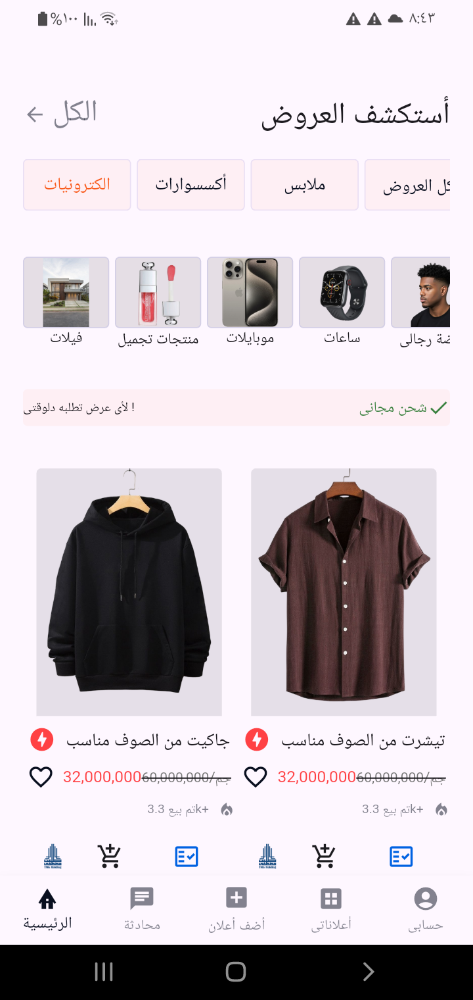
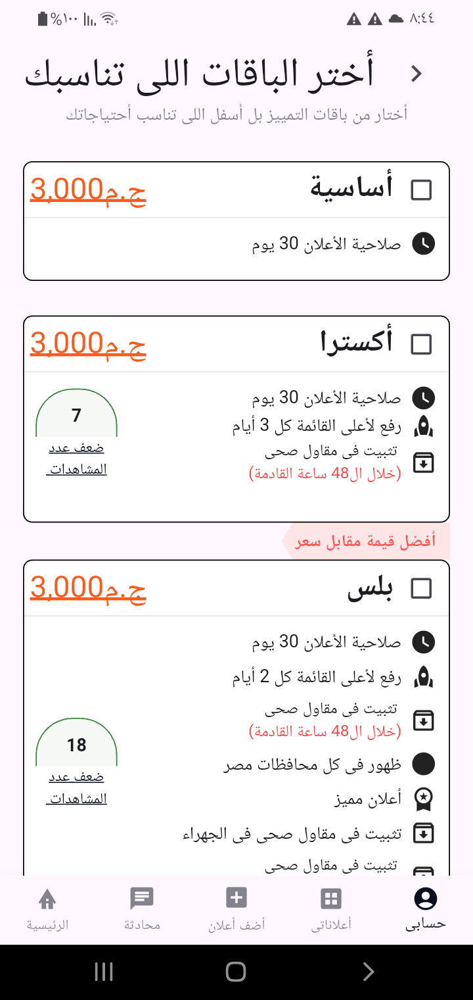
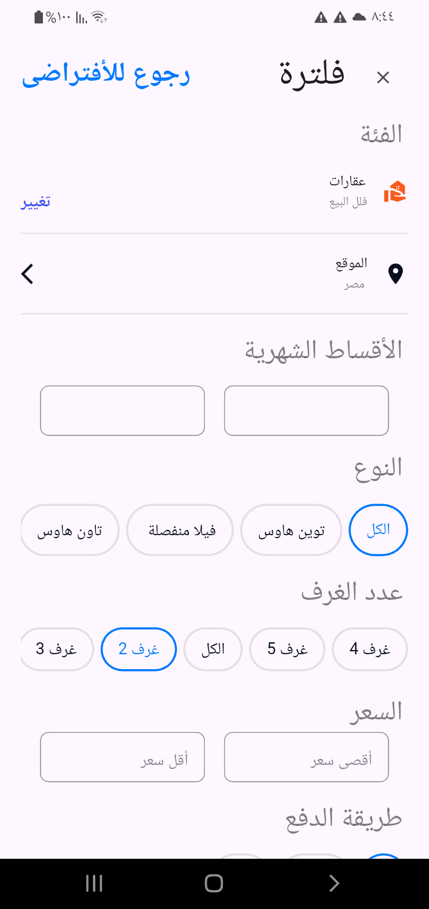

# flutter_Task 

A new Flutter project.

## Getting Started

# Screenshots 

  

  
  
  

  

 # 🧰 Tools & Technologies Used
| الفئة | الأدوات / التقنيات | الوصف |
|-------|--------------------|--------|
| ⚙️ **Framework & Language** | **Flutter (Dart)** | لبناء واجهات المستخدم والتطبيق بالكامل. |
| 🗄️ **Database & Local Storage** | **Sqflite**   **Hive** | تخزين البيانات في قاعدة SQLite (مثل الجداول: `rooms`, `bouquet`, `categories`). تخزين الإعدادات المحلية (اللغة، الثيم). |
| 🧠 **State Management** | **Bloc / Cubit (flutter_bloc)** | لإدارة الحالة (state) بطريقة منظمة وسهلة الصيانة والاختبار. |
| 🎨 **UI & Design** | **Google Fonts (Tajawal)**   **Custom Widgets**   **Custom Colors / ClipPath** | لتوحيد الخط العربي وتصميم واجهات احترافية بلمسات مخصصة. |
| 🔔 **Notifications & Loaders** | **toastification**   **CircularProgressIndicator** | لعرض رسائل النجاح أو الخطأ، ومؤشرات التحميل بتصميم مخصص. |
| 🧩 **Architecture & Logic** | **Modular Architecture**   **Repository-like Pattern** | لفصل منطق التطبيق عن الواجهة وتسهيل التطوير والصيانة. |
| 🧭 **Navigation** | **Named Routes**   **BottomNavigationBar** | إدارة التنقل بين الشاشات مثل `/`, `/filter`, `/bouquet`. |
| 📂 **File Handling** | **FilePicker** | لاختيار الصور من الجهاز وإضافتها إلى قاعدة البيانات. |
| 🌗 **Theme & Localization** | **Light/Dark Mode**   **Arabic Localization (RTL)** | دعم الوضع الليلي والنهاري واللغة العربية بشكل كامل. |
| 🧪 **Testing & Debugging** | **Future.delayed**   **Logging (log)** | لاختبار شاشات التحميل وتتبع حالة الـ Cubits أثناء التطوير. |

---

This project is a starting point for a Flutter application.

A few resources to get you started if this is your first Flutter project:

- [Lab: Write your first Flutter app](https://docs.flutter.dev/get-started/codelab)
- [Cookbook: Useful Flutter samples](https://docs.flutter.dev/cookbook)

For help getting started with Flutter development, view the
[online documentation](https://docs.flutter.dev/), which offers tutorials,
samples, guidance on mobile development, and a full API reference.
